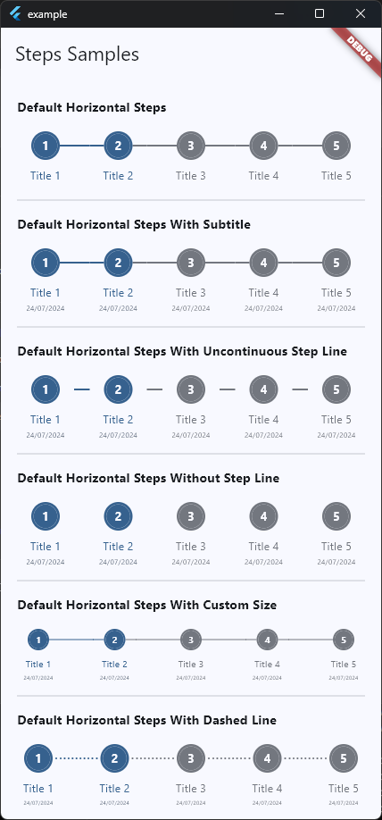
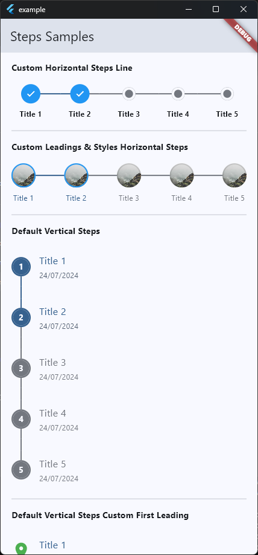

# Flutter Steps

The Flutter Steps package is a customizable widget that allows you to display a series of steps in a horizontal or vertical direction. This package can be used for creating step indicators for onboarding processes, progress tracking, or any other multi-step process in your Flutter application.

## Key Features

- **Flexible Direction**: Display steps horizontally or vertically based on your layout needs.
- **Customizable Appearance**: Adjust colors, fonts, and sizes for active and inactive steps, titles, and subtitles.
- **Step Line Options**: Show or hide the line connecting steps, with options for continuous or dashed lines.
- **Step Counters**: Optionally display counters for each step.
- **Interactive**: Supports showing subtitles and custom leading elements for active and inactive steps.

<br/>
<p align="left">
  
  
  
</p>

## Installation

Add the following to your `pubspec.yaml` file:

```yaml
dependencies:
  flutter_steps: ^1.0.0
```

Then run `flutter pub get` to install the package.

## Usage
### Basic Usage

```
import 'package:flutter/material.dart';
import 'package:flutter_steps/flutter_steps.dart';

List<Steps> basicSteps = [
  ...List.generate(
    5,
    (i) => Steps(
      title: 'Title ${i + 1}',
      subtitle: 'Subtitle',
      isActive: i < 2 ? true : false,
    ),
  )
];

class MyApp extends StatelessWidget {
  const MyApp({super.key});

  @override
  Widget build(BuildContext context) {
    return MaterialApp(
      home: Scaffold(
        body: FlutterSteps(
          steps: basicSteps,
          titleFontSize: 12,
          showSubtitle: false,
        ),
      ),
    );
  }
}
```

## Example
Check out the [example](example) directory for a complete sample app demonstrating the use of the app_image package.

## License
This project is licensed under the MIT License - see the [LICENSE](LICENSE) file for details.

## Support

<a href="https://trakteer.id/elrizwiraswara/tip" target="_blank"></a>
